Here's your enhanced `README.md` with **working Mermaid diagrams** and improved formatting for GitHub rendering:

```markdown
# Neon EVM SPL Token Program Interface


A Solidity contract demonstrating how to interact with Solana's SPL Token Program from Neon EVM using composability libraries.

## Features

- Create and initialize SPL token mints
- Manage associated token accounts (ATAs) and arbitrary token accounts
- Mint, transfer, and burn tokens
- Handle token approvals and delegations
- Update mint and account authorities
- Query token and account data
- Support for Wrapped SOL operations

## Key Concepts

- Create and initialize SPL token mints
- Manage associated token accounts (ATAs) and arbitrary token accounts
- Mint, transfer, and burn tokens
- Handle token approvals and delegations
- Update mint and account authorities
- Query token and account data
- Support for Wrapped SOL operations

## Key Concepts

### Solana Token Model
- **Mint Account**: Stores token metadata (supply, decimals, authorities)
- **Token Account**: Holds tokens for specific owner+mint pairs
- **Associated Token Account (ATA)**: Default token account derived from owner+mint
- **Arbitrary Token Account**: Custom token accounts with flexible derivation


- **Mint Account**: Stores token metadata (supply, decimals, authorities)
- **Token Account**: Holds tokens for specific owner+mint pairs
- **Associated Token Account (ATA)**: Default token account derived from owner+mint
- **Arbitrary Token Account**: Custom token accounts with flexible derivation

## Installation

1. Clone the repository:
```bash
git clone https://github.com/beebozy/NEON/edit/main/week4-neon.git
```

2. Install dependencies:
```bash
npm install
# or
yarn install
```

## Usage

### Basic Operations
```solidity
// Initialize a new token mint
function createInitializeTokenMint(bytes memory seed, uint8 decimals) external;

// Create an arbitrary token account
function createInitializeArbitraryTokenAccount(
    bytes32 tokenMint, 
    bytes32 owner, 
    bytes32 tokenOwner
) external;

// Mint tokens
function mint(bytes memory seed, bytes32 recipientATA, uint64 amount) external;

// Transfer tokens
function transfer(bytes32 tokenMint, bytes32 recipientATA, uint64 amount) external;
```

### Advanced Operations
```solidity
// Approve a delegate
function approve(bytes32 tokenMint, bytes32 delegate, uint64 amount) external;

// Burn tokens
function burn(bytes32 tokenMint, uint64 amount) external;

// Update mint authority
function updateTokenMintAuthority(
    bytes memory seed,
    LibSPLTokenProgram.AuthorityType authorityType,
    bytes32 newAuthority
) external;
```

## Workflow

```mermaid
sequenceDiagram
    participant User
    participant NeonEVM
    participant Solana
    User->>NeonEVM: Call createInitializeTokenMint()
    NeonEVM->>Solana: createResource()
    Solana-->>NeonEVM: Mint Account Address
    NeonEVM->>Solana: initializeMint2()
    Solana-->>User: ✅ Mint Ready!
```


## Contract Structure
| **Component**          | **Purpose**                              |
|------------------------|------------------------------------------|
| `CallSPLTokenProgram.sol` | Main interface contract                 |
| `LibSPLTokenProgram`   | Core SPL Token Program operations        |
| `LibSPLTokenData`      | Token data structures and getters        |
| `LibAssociatedTokenData` | ATA management                          |

## Development

### Requirements
- Solidity 0.8.28+
- Neon EVM environment
- Solana toolchain

### Testing
```bash
npx hardhat test ./test/composability/spl-token.test.js --network neondevnet
```
